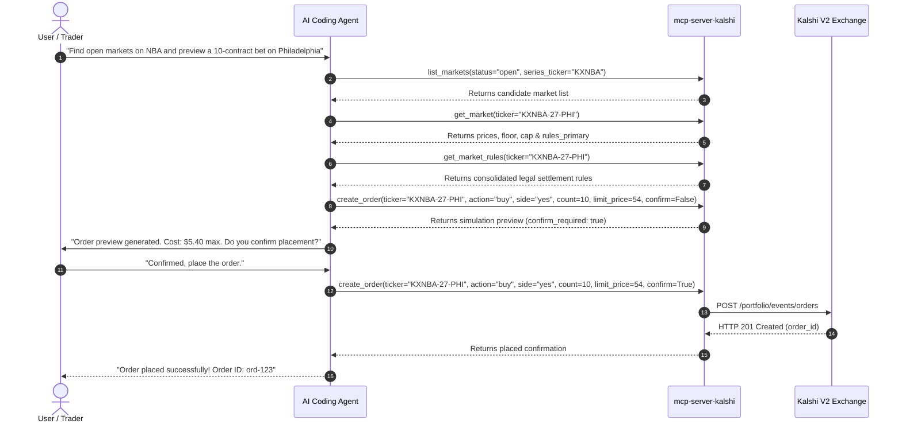

# 📖 Kalshi MCP Server Runbook & Cookbook

This cookbook provides operational recipes for engineers and AI agents developing, testing, maintaining, and automating Kalshi prediction market operations via `mcp-server-kalshi`.

---

## 🍳 Recipe 1: The Release & Version Bump Lifecycle

Follow these steps in exact sequential order:

*   **Step 1: Create a Feature Branch**
    *   Never develop directly on `main`. Create a new branch: `git checkout -b <type>/<description>`.
*   **Step 2: Implement and Stage Changes**
    *   Write clean, type-safe Python code conforming to `mypy --strict`.
    *   Stage the files: `git add <files>`.
*   **Step 3: Run Local Static Analysis**
    *   Verify type safety: `uv run mypy`.
    *   Verify linting: `uv run ruff check .`.
    *   Verify formatting: `uv run black --check src tests && uv run ruff format --check .`.
    *   Verify code coverage is at 100%: `uv run pytest --cov=src/mcp_server_kalshi --cov-fail-under=100`.
*   **Step 4: Execute Contract & Drift Verifications**
    *   Validate tool contracts: `uv run python scripts/check_tool_contract.py`.
    *   Validate OpenAPI route parity: `uv run python scripts/check_openapi_drift.py`.
    *   Execute stdio handshake smoke test: `uv run python scripts/smoke_test.py`.
*   **Step 5: Document Changes (Changelog, Readme, Server Manifest)**
    *   Increment the version in `pyproject.toml`.
    *   Sync version details and environment variables inside `server.json`.
    *   *Constraint*: The `description` field in `server.json` **must be strictly 100 characters or fewer** to pass MCP Registry validation.
    *   Add release notes to `CHANGELOG.md`.
*   **Step 6: Commit and Push**
    *   Commit with a conventional commit message: `git commit -m "feat: description"`.
    *   Push to your fork on GitHub: `git push -u origin <branch>`.
*   **Step 7: Create Pull Request and Wait for CI & CodeRabbit**
    *   Open a Pull Request: `gh pr create --fill`.
    *   Wait for online CI matrix and CodeRabbit review comments.
*   **Step 8: Tag and Publish Release**
    *   Once merged to `main`, checkout `main` and pull: `git checkout main && git pull`.
    *   Tag the release matching `pyproject.toml` version: `git tag v0.2.4`.
    *   Push tag to trigger GitHub Action release to PyPI, MCP Registry, and GHCR Docker: `git push origin v0.2.4`.

---

## 🍳 Recipe 2: Safe Market Diligence & Order Execution (AI Agent Workflow)



---

## 🍳 Recipe 3: Batch Market Making & Order Canceling

1. **Market Making Quoting**:
   - Construct two-sided quotes:
     ```python
     orders = [
         {"ticker": "KXNBA-27-PHI", "action": "buy", "side": "yes", "count": 20, "limit_price": 52},
         {"ticker": "KXNBA-27-PHI", "action": "sell", "side": "yes", "count": 20, "limit_price": 56},
     ]
     await handle_batch_create_orders({"orders": orders, "confirm": True})
     ```
2. **Emergency Position Flattening / Risk Cancellation**:
   - Query resting orders: `list_orders(status="resting")`.
   - Batch cancel all resting IDs in a single atomic request:
     ```python
     await handle_batch_cancel_orders({"order_ids": ["ord-1", "ord-2", "ord-3"]})
     ```
