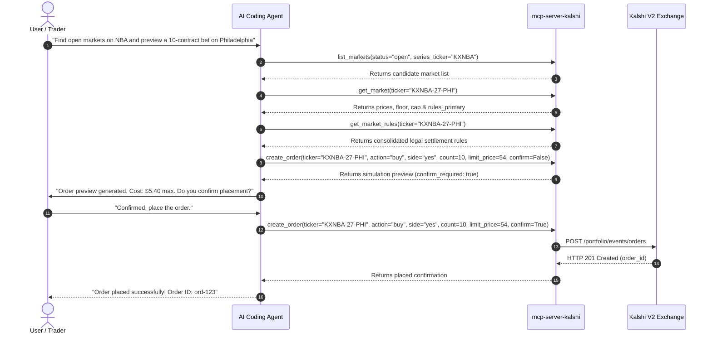

# 📖 Kalshi MCP Server Runbook & Cookbook

This cookbook provides operational recipes for engineers and AI agents developing, testing, maintaining, and automating Kalshi prediction market operations via `mcp-server-kalshi`.

---

## 🍳 Recipe 1: The Release & Version Bump Lifecycle (Canonical 9-Step SOP)

Follow these steps in exact sequential order:

*   **Step 1: Create a Feature Branch**
    *   Never develop on `main`. Create a new branch: `git checkout -b <type>/<description>`.
*   **Step 2: Implement and Stage Changes**
    *   Write clean, type-safe Python code conforming to `mypy`.
    *   Stage the files: `git add <files>`.
*   **Step 3: Run Local Static Analysis**
    *   Verify type safety: `uv run mypy`.
    *   Verify linting: `uv run ruff check .`.
    *   Verify formatting: `uv run ruff format --check .`.
    *   Verify code coverage is at 100%: `uv run pytest --cov=src/mcp_server_kalshi --cov-fail-under=100`.
    *   Verify tool contracts: `uv run python scripts/check_tool_contract.py`.
    *   Verify OpenAPI route parity: `uv run python scripts/check_openapi_drift.py`.
    *   Verify stdio handshake: `uv run python scripts/smoke_test.py`.
*   **Step 4: Execute Local AI Self-Review Loop**
    *   Instruct the active AI assistant: *"Analyze the git diff --cached. Audit for secret leaks, traversal vulnerabilities, type safety, and correctness."*
    *   If any issues are flagged, resolve them locally, re-stage, and re-run Steps 3 and 4 until 100% clean.
*   **Step 5: Document Changes (Changelog, Readme, Server Manifest)**
    *   Increment the version in `pyproject.toml` and `src/mcp_server_kalshi/__init__.py`.
    *   Sync version details and environment variables inside `server.json`.
    *   *Constraint*: The `description` field in `server.json` **must be strictly 100 characters or fewer** to pass MCP Registry validation (longer strings trigger HTTP 422).
    *   Add release notes to `CHANGELOG.md`.
    *   If tool capabilities or parameters changed, update `README.md` and `skills/kalshi-mcp/SKILL.md`.
*   **Step 6: Commit and Push**
    *   Commit with a conventional commit message: `git commit -m "conventional_prefix: description"`.
    *   Push to your fork on GitHub: `git push -u origin <branch>`.
    *   *Tip (Branch Updates)*: If the branch falls behind `main`, use "Update branch" on GitHub or run `gh pr merge --update-branch`. If merging locally, complete with `git commit -m "merge: sync branch with main"`.
*   **Step 7: Create Pull Request and Wait for CodeRabbit**
    *   Open a Pull Request: `gh pr create --fill`.
    *   **Wait-State**: Do not merge immediately. Wait for the online CodeRabbit bot to finish analyzing the PR and post its review comment.
*   **Step 8: Review CodeRabbit Comments and Finalize**
    *   Read online CodeRabbit PR review comments.
    *   If suggestions are valid, apply them locally, commit, and push.
    *   Once CodeRabbit review is resolved, queue auto-merge: `gh pr merge --auto --squash`.
    *   *Squash Merging constraint*: This suite enforces **Squash Merging only** on GitHub. Ensure the PR title is written as a Conventional Commit (e.g. `feat: ...`). During merge, verify the squash commit title/body to ensure it follows Conventional Commits.
    *   *Rate Limit Fallback*: If CodeRabbit reports a review rate-limit block, verify that Step 3 and Step 4 (Local AI Self-Review Loop) passed with 100% success, and then bypass and merge via `gh pr merge --squash --admin`.
*   **Step 9: Tag and Publish Release**
    *   Once merged to `main`, checkout `main` and pull: `git checkout main && git pull`.
    *   Tag the release matching `pyproject.toml` version: `git tag vX.Y.Z`.
    *   Push tag to trigger GitHub Action release to PyPI, MCP Registry, and GHCR Docker: `git push origin vX.Y.Z`.
    *   *CI Failure/PyPI Duplicate Fallback*: PyPI has a strict **no-overwrite policy** for files. If a release workflow fails *after* PyPI upload completes, you **cannot** re-run or re-push the same tag. You **must** increment the patch version in `pyproject.toml`, `__init__.py`, and `server.json` (e.g. `0.2.4` -> `0.2.5`), open a new PR, merge it, and push the new version tag.

---

## 🍳 Recipe 2: Safe Market Diligence & Order Execution (AI Agent Workflow)



---

## 🍳 Recipe 3: Batch Market Making & Order Canceling

1. **Market Making Quoting**:
   - Construct two-sided quotes:
     ```python
     orders = [
         {"ticker": "KXNBA-27-PHI", "action": "buy", "side": "yes", "count": 20, "limit_price": 52},
         {"ticker": "KXNBA-27-PHI", "action": "sell", "side": "yes", "count": 20, "limit_price": 56},
     ]
     await handle_batch_create_orders({"orders": orders, "confirm": True})
     ```
2. **Emergency Position Flattening / Risk Cancellation**:
   - Query resting orders: `list_orders(status="resting")`.
   - Batch cancel all resting IDs in a single atomic request:
     ```python
     await handle_batch_cancel_orders({"order_ids": ["ord-1", "ord-2", "ord-3"]})
     ```

---

## 🍳 Recipe 4: Schema Drift Checks

*   **Step 1**: Run the drift monitor script: `uv run python scripts/check_openapi_drift.py`.
*   **Step 2**: If path or parameter mismatches are found, update client routes in `kalshi_client/client.py` and re-run unit tests.

---

## 🍳 Recipe 5: Local Verification & MCP Inspector

```bash
# 1. Run stdio handshake smoke test
uv run python scripts/smoke_test.py

# 2. Interactive debugging with official MCP Inspector
npx -y @modelcontextprotocol/inspector kalshi-mcp
```
