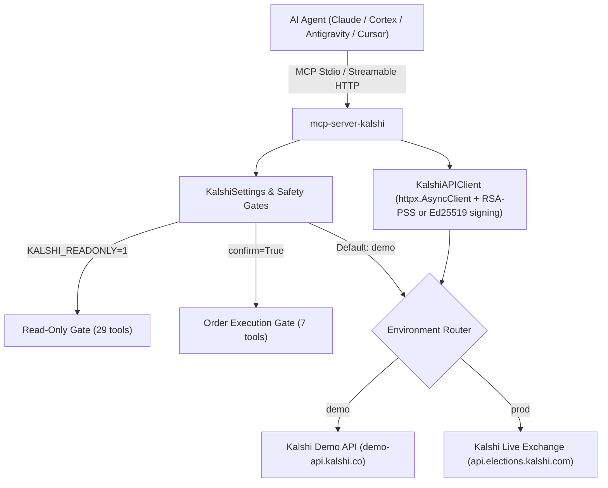

# MCP Server Kalshi

An enterprise MCP server providing AI agents with a first-class interface to [Kalshi](https://kalshi.com) prediction markets. It is built for end-to-end trading: browse markets, research them, read the *exact* settlement rules (including pulling the contract-terms PDFs), manage risk groups, and execute single & batch trades — all through type-safe MCP tools.

This repository is Christian Claudio's fork of [`9crusher/mcp-server-kalshi`](https://github.com/9crusher/mcp-server-kalshi). Install it from this git repository or from `ghcr.io/christianclaudio/mcp-server-kalshi`. Public PyPI and the MCP Registry listing stay with upstream.

---

## 🏗️ System Architecture



---

## 🚀 Highlights (36 Tools)

- **Discovery & Search** — `list_markets`, `get_market`, `list_events`, `get_event`, `list_series`, `get_series`, `get_tags_by_categories`, `get_sports_filters`.
- **Research & Live Feeds** — `get_market_orderbook`, `get_market_candlesticks`, `get_market_trades`, `get_event_live_data`, `get_milestones`, `get_milestone`.
- **Deep Contract Rules** — `get_market_rules` consolidates `rules_primary`/`rules_secondary`, early-close conditions, settlement sources, and series prohibitions; `fetch_rules_pdf` downloads and extracts the exact legal contract terms text.
- **Multivariate & Parlays** — `list_multivariate_collections`, `get_multivariate_collection`.
- **Exchange & Status** — `get_exchange_status`, `get_exchange_schedule`, `get_environment`.
- **Portfolio & Exposure** — `get_balance`, `get_portfolio_summary` (resting order value), `get_positions`, `get_fills`, `get_settlements`.
- **Trading & Execution** — `create_order`, `cancel_order`, `amend_order`, `decrease_order`, `batch_create_orders`, `batch_cancel_orders`, `list_orders`, `get_order`.
- **Risk Management & Order Groups** — `list_order_groups`, `cancel_order_group` (e.g. One-Cancels-Other OCO groups).

---

## 🛡️ Safety by Default

- **Sandbox Default:** The server targets Kalshi's **demo (sandbox)** environment unless `KALSHI_ENV=prod` is explicitly set.
- **Simulation Preview Gating:** Mutating order tools (`create_order`, `amend_order`, `decrease_order`, `cancel_order`, `batch_create_orders`, `batch_cancel_orders`, `cancel_order_group`) require `confirm=true`. Without it, they return a structured simulation **preview** and send nothing.
- **Read-Only Mode:** Run with `KALSHI_READONLY=1` to restrict registration exclusively to 29 read-only inspection tools.
- **Secret Scrubbing:** Private keys (PEM), API keys, request signatures, and Bearer tokens are scrubbed from error logs via `redact_secrets()`.
- **Intuitive Order Pricing:** Exposes intuitive whole **cents** limit pricing and automatically translates buy-NO ⇄ sell-YES orderbook math.

---

## ⚙️ Configuration

| Variable | Default | Purpose |
| :--- | :---: | :--- |
| `KALSHI_ENV` | `demo` | `demo` (sandbox) or `prod` (real money). |
| `KALSHI_API_KEY` / `KALSHI_API_KEY_ID` | _(none)_ | Kalshi API key ID. Required for portfolio and order tools. |
| `KALSHI_PRIVATE_KEY_PATH` | _(none)_ | Path to your RSA or Ed25519 private key `.pem`. |
| `KALSHI_READONLY` | `0` / `false` | When enabled (`1`), disables all mutating order endpoints at startup. |
| `BASE_URL` | _(derived)_ | Optional REST override. Only `https://demo-api.kalshi.co/trade-api/v2` or `https://api.elections.kalshi.com/trade-api/v2`. |

---

## 📦 Client Configuration

### Claude Desktop (`claude_desktop_config.json`)
```json
{
  "mcpServers": {
    "kalshi": {
      "command": "uvx",
      "args": ["--from", "git+https://github.com/christianclaudio/mcp-server-kalshi", "mcp-server-kalshi"],
      "env": {
        "KALSHI_ENV": "demo",
        "KALSHI_API_KEY": "<YOUR_KALSHI_API_KEY>",
        "KALSHI_PRIVATE_KEY_PATH": "/path/to/kalshi-rsa.pem"
      }
    }
  }
}
```

### Google Antigravity & Gemini CLI (`~/.gemini/antigravity-cli/mcp_config.json`)
```json
{
  "mcpServers": {
    "kalshi": {
      "command": "uvx",
      "args": ["--from", "git+https://github.com/christianclaudio/mcp-server-kalshi", "mcp-server-kalshi"],
      "env": {
        "KALSHI_ENV": "demo",
        "KALSHI_API_KEY": "<YOUR_KALSHI_API_KEY>",
        "KALSHI_PRIVATE_KEY_PATH": "/path/to/kalshi-rsa.pem"
      },
      "lazy": true
    }
  }
}
```

### Snowflake Cortex (`~/.snowflake/cortex/mcp.json`)
```json
{
  "mcpServers": {
    "kalshi": {
      "command": "uvx",
      "args": ["--from", "git+https://github.com/christianclaudio/mcp-server-kalshi", "mcp-server-kalshi"],
      "env": {
        "KALSHI_ENV": "demo",
        "KALSHI_API_KEY": "<YOUR_KALSHI_API_KEY>",
        "KALSHI_PRIVATE_KEY_PATH": "/path/to/kalshi-rsa.pem"
      },
      "lazy": true
    }
  }
}
```

### Cursor & VS Code (Cline / Roo Code)
Add to `.cursor/mcp.json` or `cline_mcp_settings.json`:
```json
{
  "mcpServers": {
    "kalshi": {
      "command": "uvx",
      "args": ["--from", "git+https://github.com/christianclaudio/mcp-server-kalshi", "mcp-server-kalshi"],
      "env": {
        "KALSHI_ENV": "demo",
        "KALSHI_API_KEY": "<YOUR_KALSHI_API_KEY>",
        "KALSHI_PRIVATE_KEY_PATH": "/path/to/kalshi-rsa.pem"
      }
    }
  }
}
```

### Local HTTP / Streamable HTTP Transport
Launch the FastMCP server over modern Streamable HTTP:
```bash
python -m mcp_server_kalshi.server --transport streamable-http --host 127.0.0.1 --port 8000
```

Connect your HTTP client or proxy to `http://127.0.0.1:8000/mcp`.

**HTTP authentication.** Set `KALSHI_MCP_AUTH_TOKEN` to require `Authorization: Bearer <token>` on every HTTP request; a missing or wrong token gets `401`. The token is stripped, and a blank value counts as unset. It is attached when the server is built, so `mcp-server-kalshi`, `fastmcp run` and an ASGI host mounting `mcp.http_app()` (or `mcp.streamable_http_app()`) all enforce it when it is set. stdio never uses it.

With no token, `mcp-server-kalshi` still starts an HTTP bind to `127.0.0.1`, `::1` or `localhost`, unauthenticated, and logs a warning. A tokenless bind to any other host exits with code 2. Set the token, bind to localhost, or set `KALSHI_MCP_ALLOW_UNAUTHENTICATED_BIND` to `1`, `true`, `yes` or `on` to accept an unauthenticated public bind (any other value refuses). Other entry points get the token but not the localhost check: `fastmcp run` and `http_app()` do not go through `mcp-server-kalshi`'s `main()`, so a bind to `0.0.0.0` with no token there is not refused and serves without authentication. The host or its process manager owns the bind address, so set `KALSHI_MCP_AUTH_TOKEN` there.

To serve the image over HTTP, pass credentials and the token from your environment or an env file, never on the command line:

```bash
# export KALSHI_ENV, KALSHI_API_KEY and KALSHI_MCP_AUTH_TOKEN first, or use --env-file .env
docker run --rm -p 8000:8000 \
  -v /path/to/kalshi-key.pem:/home/mcp/kalshi-key.pem:ro \
  -e KALSHI_ENV -e KALSHI_API_KEY -e KALSHI_MCP_AUTH_TOKEN \
  -e KALSHI_PRIVATE_KEY_PATH=/home/mcp/kalshi-key.pem \
  ghcr.io/christianclaudio/mcp-server-kalshi \
  --transport streamable-http --host 0.0.0.0 --allowed-host mcp.example.com
```

Replace `mcp.example.com` with the host name clients use to reach the server.

**Known limits.**
* Only `mcp-server-kalshi` refuses a tokenless public bind (exit code 2). `fastmcp run` and `mcp.http_app()` enforce the token when it is set but do not refuse a tokenless public bind.
* A token changed after the server is built is not picked up; restart the server.

### Docker
```json
{
  "mcpServers": {
    "kalshi": {
      "command": "docker",
      "args": ["run", "--rm", "-i",
        "-v", "/path/to/kalshi-key.pem:/home/mcp/kalshi-key.pem:ro",
        "-e", "KALSHI_ENV", "-e", "KALSHI_API_KEY",
        "-e", "KALSHI_PRIVATE_KEY_PATH=/home/mcp/kalshi-key.pem",
        "ghcr.io/christianclaudio/mcp-server-kalshi:latest"
      ]
    }
  }
}
```

The image runs as the non-root `mcp` user, so the mounted key file must be readable by that user.

---

## 🧪 Verification & Local Development

```bash
# 1. Install dependencies
uv sync --locked --all-extras

# 2. Run unit & offline tests (100% coverage enforced)
uv run pytest --cov=src/mcp_server_kalshi --cov-fail-under=100

# 3. Static type analysis & linting
uv run mypy --strict
uv run ruff check .
uv run black --check src tests

# 4. Tool contract, drift & protocol conformance validation
uv run python scripts/check_tool_contract.py
uv run python scripts/check_openapi_drift.py
./scripts/check_conformance.sh
```

---

## 📚 Documentation & Guides

- 🛡️ [Security Policy & Guidelines](SECURITY.md)
- 🤝 [Contributing Guidelines](CONTRIBUTING.md)
- 🧪 [Testing & Verification Invariants](TESTING.md)
- 📝 [Changelog (GitHub Releases)](https://github.com/christianclaudio/mcp-server-kalshi/releases)
